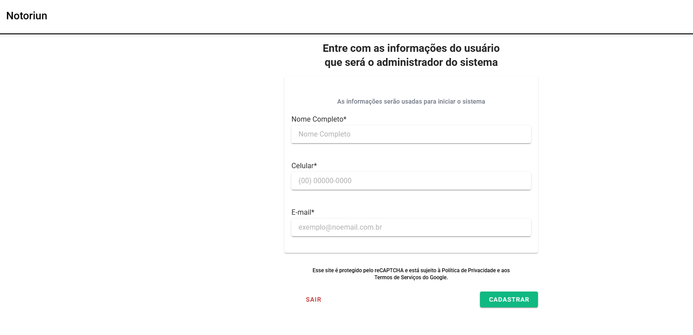

# Teste Técnico -  Quero Delivery

Esse repositório contém o teste técnico realizado com Typescript/Node/Express/MongoDB/PostgreSQL. O projeto tem como objetivo simular um sistema de microserviços com integração entre API de usuários e API de produtos, além de fornecer funcionalidades de carrinho de compras utilizando MongoDB.

## Atenção ao rodar

O projeto usa várias portas. Caso essas portas estejam em uso, será necessário modificá-las no arquivo `docker-compose.yml`:

1. **PostgreSQL (Banco de Dados)**:  
    - `5433:5432` | container_postgres_database

2. **App Web**:  
    - `8080:80` | container_web_client

3. **API**:  
    - `4040:4040` | container_nest_api

O Docker Compose é utilizado para orquestrar os contêineres, com variáveis de ambiente configuradas para as duas APIs. Certifique-se de que todos os processos do compose rodaram com sucesso.

## Tabela de Conteúdo

- [Preview](#preview)
- [Entidades](#entidades)
- [Instalação](#instalação)
- [Informações](#informações)

## Preview
<div align="center">
     
</div>

## Entidades

O projeto inclui as seguinte entidade:

### User
- **`id`**: Identificador único do usuário. (UUID)
  - **Descrição**: Identificador único gerado automaticamente para o usuário.
  - **Exemplo**: `550e8400-e29b-41d4-a716-446655440000`

- **`name`**: Nome do usuário.
  - **Descrição**: Nome completo do usuário.
  - **Exemplo**: `John Doe`

- **`userPhoneCode`**: Código de área do telefone do usuário.
  - **Descrição**: Código de discagem do país ou região.
  - **Exemplo**: `55`

- **`userPhone`**: Número de telefone do usuário.
  - **Descrição**: Número de telefone sem o código de área.
  - **Exemplo**: `991651234`

- **`email`**: Email do usuário.
  - **Descrição**: Endereço de email único para o usuário.
  - **Exemplo**: `john.doe@example.com`

- **`cnpj`**: Código legal da instituição.
  - **Descrição**: CNPJ vinculado à instituição do usuário.
  - **Exemplo**: `123456`

- **`institutionName`**: Nome da instituição.
  - **Descrição**: Nome completo da instituição vinculada ao usuário.
  - **Exemplo**: `Empresa Exemplo Ltda.`

- **`institutionPhoneCode`**: Código de área do telefone da instituição.
  - **Descrição**: Código de discagem internacional para a instituição.
  - **Exemplo**: `55`

- **`institutionPhone`**: Número de telefone da instituição.
  - **Descrição**: Número de telefone da instituição, sem o código de área.
  - **Exemplo**: `991651234`

- **`institutionEmail`**: Email da instituição.
  - **Descrição**: Endereço de email institucional.
  - **Exemplo**: `institutional@example.com`

- **`postalCode`**: Código postal da instituição.
  - **Descrição**: CEP da localização da instituição.
  - **Exemplo**: `12345678`

- **`state`**: Estado da instituição.
  - **Descrição**: Estado (UF) onde a instituição está localizada.
  - **Exemplo**: `São Paulo`

- **`city`**: Cidade da instituição.
  - **Descrição**: Cidade onde a instituição está localizada.
  - **Exemplo**: `São Paulo`

- **`neighborhood`**: Bairro da instituição.
  - **Descrição**: Bairro onde a instituição está localizada.
  - **Exemplo**: `Liberdade`

- **`address`**: Endereço da instituição.
  - **Descrição**: Rua ou avenida onde a instituição está localizada.
  - **Exemplo**: `Rua dos Bobos`

- **`number`**: Número do endereço da instituição.
  - **Descrição**: Número da localização específica no endereço.
  - **Exemplo**: `0`

- **`complement`**: Complemento do endereço da instituição.
  - **Descrição**: Complemento do endereço, como apartamento ou sala.
  - **Exemplo**: `AP 101`

- **`location`**: Localização geográfica do usuário.
  - **Descrição**: Ponto de localização representado por latitude e longitude.
  - **Exemplo**: `{ type: 'Point', coordinates: [-46.633308, -23.55052] }`

- **`createdAt`**: Data de criação do registro do usuário.
  - **Descrição**: Data e hora em que o usuário foi criado no sistema.
  - **Exemplo**: `2021-07-01T00:00:00.000`

- **`updatedAt`**: Data de atualização do registro do usuário.
  - **Descrição**: Data e hora da última atualização no registro do usuário.
  - **Exemplo**: `2021-07-10T00:00:00.000`


## Instalação

### Pré-requisitos
Para rodar o projeto é necessário ter o Docker e Docker Compose instalados.

### Passos de instalação

```bash
# Clone o repositório
git clone https://github.com/Arturstriker3/test-notoriun

# Navegue até o diretório do projeto
cd test-notoriun

# Execute o comando para rodar o frontend, banco de dados e o backend juntos, dockerizados
docker-compose up -d
```

## Informações

Para testar o projeto basta somente acessar no navegador o localhost específico

1. **Frontend (Banco de Dados)**:  
    - `http://localhost:4000`

2. **Frontend**:  
    - `http://localhost:8080`